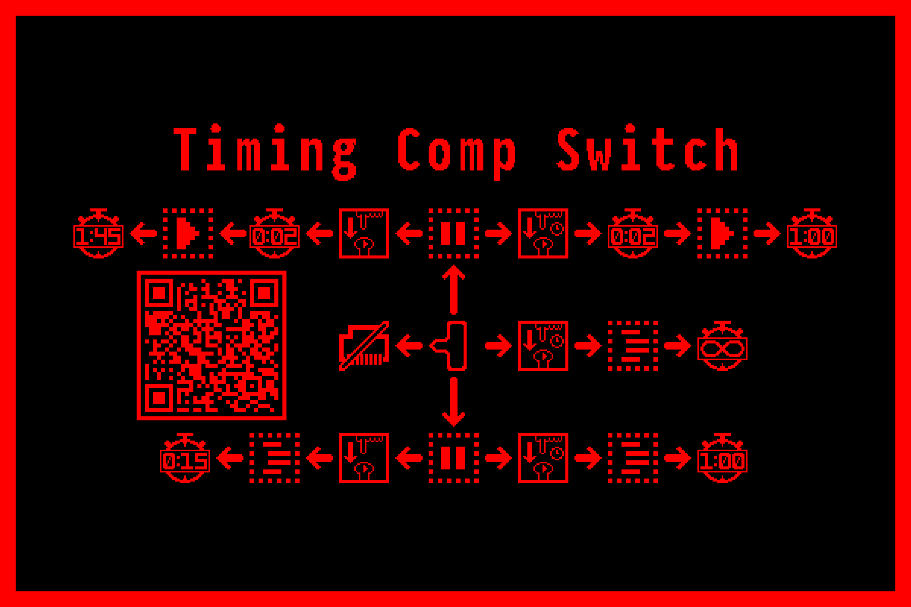
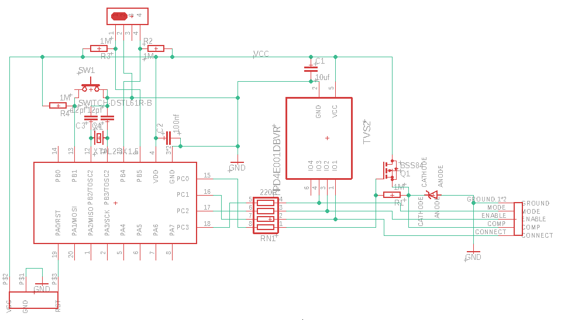
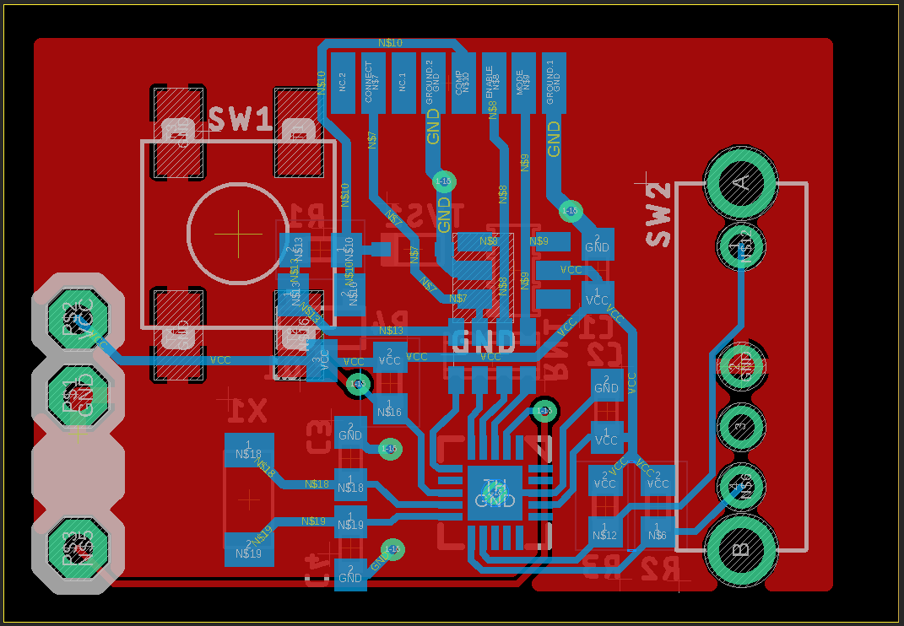

## __Timing Vex Competition Switch__  

This is a reposity for the information about how to build and use Timing Competition Switch  

If you are interested in contacting me to buy one, please use this [Whatsapp Link](https://wa.me/16503987996), or DM me on Vex Forum under the username Puzzlers100.
#### USE  

The Slider has 3 positions, up, down or center. In each position, pressig the button does something different, as does holding it for half a second before releasing  
- UP - DRIVER Position, the robot is disabled
    - Push - Starts a 1 minute and 45 second Driver period, after 1 and a half seconds of delay, simulating a match (though only - for one person)
    - Hold - Starts a 1 minute skills match, after 1 and half seconds of delay
- CENTER - DISCONNECTED - the robot doesn't see the compswitch.
    - HOLD - Starts and infinate Auton period. This can be disabled by pressing the button again
- DOWN - AUTON Position, the robot is disabled
    - Push - Starts a 15 second Autonomous period, simulating a match
    - HOLD - Starts a 1 minute Autonomous skills period  
If the robot is enabled, pressing the button or moving the slider will immedietly disable it, if your auton is going to run into something, you can stop it.
#### BUILD GUIDE

1. Get a circuit board - These can be manufactured by a lot of different companies, however the pre-made gerbers are for JLCPCB, and also include files needed for PCB assembly, if desired. OSH park can use the EAGLE files directly, but if you want to use another manufacturer, you can remake the Gerbers in EAGLE to their specification. Eagle can be downloaded for free from autodesk, though you may need to make an account.       

    
2. Buy the needed parts - There is a BOM with part numbers included, however most parts can be substituted if you can find something with the same specifications and footprint   

3. Soldering - Have fun with this step, the parts are tiny and close to each other, so watch out for shorts. I recommend doing the surface mount first, then the slider and button, and the RJ-45 cable last. The pad order for the Rj-45 cable is 1,2,3,6,4,5,7,8, as it is otimized to be used with a flat CAT6 cable, which keeps 3 and 6 together. Pin 1 is ground, and the closest pin to the sliding switch. I recommend testing it, then covering the wires with UV-curing epoxy to protect it. 
  
4.  Flashing the Software - The board uses an UPDI programming interface, with the following pinnout 1: VCC, 2: GND, 3: BLANK, 4: UPDI_DATA. The makefile is set up to use an ATtiny416 xplained nano as a programmer. Run `make` in the Software folder to build the firmware, or directly `make prod` to upload it and program the fuses. You may need the latest version of AVRdude and AVR-gcc with the Microchip ATtiny pack installed. 

5.  3D print the case - If you don't have a 3D printer, look around the local area and see if there is a public makerspace. Some public libraries may also have them. If you want the text, it can be done with a single color printer by printing just the two layers of text, then switching and printing the whole switch around it
